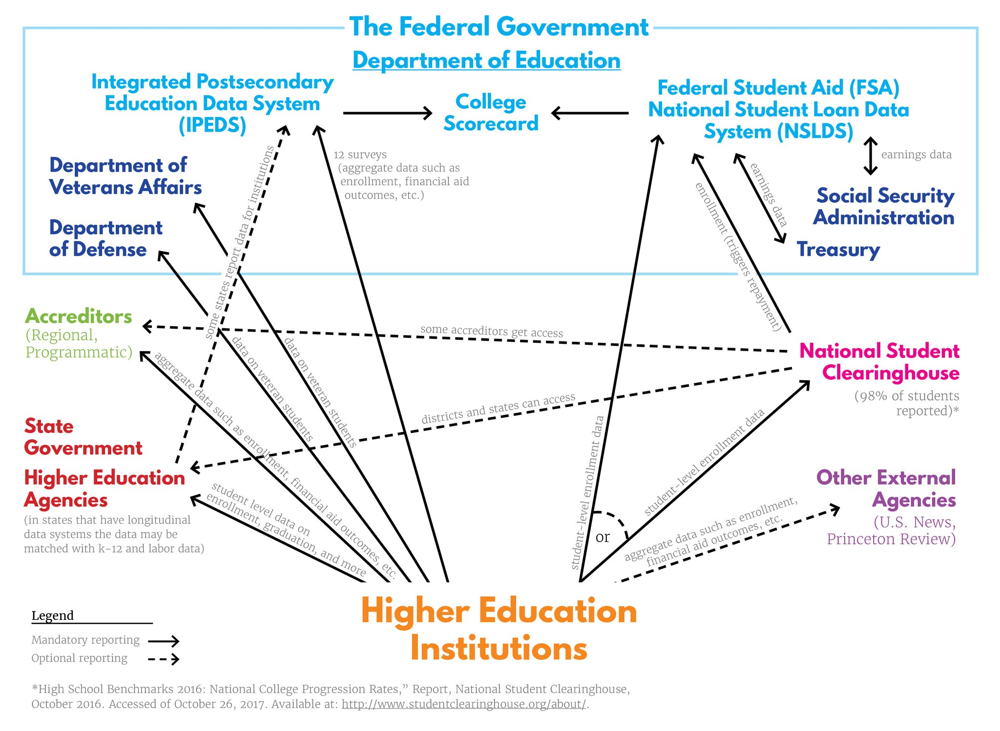

# 1. Project StataIPEDSAll Introduction

These files will download, build, and save to the local computer data from the US DOE's Integrated Postsecondary Education Data Stystem. All files are intended to be reverse compatible to Version 13. Use of version control. Also uses `saveold`. Intended as reverse compatible, but not tested. **Notes about assumptions or limitations maintained in the do files.**

For a related/similar repo built for R see [btskinner/downloadipeds](https://github.com/btskinner/downloadipeds).

## 1.1. IPEDS Update Cylces (Revised releases)

Occassionaly IPEDS provides preliminary release data which is later replaced with revised data. [They publish information about their schedule](https://surveys.nces.ed.gov/ipeds/ViewContent.aspx?contentId=15). IPEDS conventions place "rv" in csv filenames to denote revised data. As I am able I update these do files to reference revised data. 

If I'm behind on an update send me a note. Or branch the project, revise on your own, and submit a pull request. For beginners, contact me and I'll help you learn how. Updates logged in do file headers. An aggregated [Testing & Development Log](#4-testing-and-development-log) is available [below](#4-testing-and-development-log).

## 1.2. Table of Contents
<!-- TOC -->

- [1. Project StataIPEDSAll Introduction](#1-project-stataipedsall-introduction)
    - [1.1. IPEDS Update Cylces (Revised releases)](#11-ipeds-update-cylces-revised-releases)
    - [1.2. Table of Contents](#12-table-of-contents)
    - [1.3. Additional Background](#13-additional-background)
- [2. Usage](#2-usage)
    - [2.1. IPEDSDirInfo02to16.do](#21-ipedsdirinfo02to16do)
        - [2.1.1. Run from online](#211-run-from-online)
        - [2.1.2. Suggested naming convention](#212-suggested-naming-convention)
    - [2.2. IPEDSInstChar02to16.do](#22-ipedsinstchar02to16do)
        - [2.2.1. Run from online](#221-run-from-online)
        - [2.2.2. Suggested naming convention](#222-suggested-naming-convention)
    - [2.3. IPEDS12MoEnrl02to16.do](#23-ipeds12moenrl02to16do)
        - [2.3.1. Run from online](#231-run-from-online)
        - [2.3.2. Suggested naming convention](#232-suggested-naming-convention)
    - [2.4. IPEDS12MoInstrAct02to16.do](#24-ipeds12moinstract02to16do)
        - [2.4.1. Run from online](#241-run-from-online)
        - [2.4.2. Suggested naming convention](#242-suggested-naming-convention)
    - [2.5. IPEDSGradRt02to16.do](#25-ipedsgradrt02to16do)
        - [2.5.1. Run from online](#251-run-from-online)
        - [2.5.2. Suggested naming convention](#252-suggested-naming-convention)
    - [2.6. IPEDSFallEnrl02to16.do](#26-ipedsfallenrl02to16do)
        - [2.6.1. Run from online](#261-run-from-online)
        - [2.6.2. Suggested naming convention](#262-suggested-naming-convention)        
- [3. Contextual Note](#3-contextual-note)
- [4. Testing And Development Log](#4-testing-and-development-log)

<!-- /TOC -->

## 1.3. Additional Background

IPEDS provides an [origins report](https://nces.ed.gov/pubsearch/pubsinfo.asp?pubid=NPEC2012833) which documents the history of survey survey items.

# 2. Usage

## 2.1. IPEDSDirInfo02to16.do

Produces a panel data set that includes IPEDS directory information survey files.

### 2.1.1. Run from online

May be run with the following at the Stata command line.

```Stata
do https://raw.githubusercontent.com/adamrossnelson/StataIPEDSAll/master/IPEDSDirInfo02to16.do
```
### 2.1.2. Suggested naming convention

When prompted for a log file name suggested name is `IPEDSDirInfo02to16.log` which will also produce `IPEDSDirInfo02to16.dta` at the location you specify. (Update year reference as needed).

## 2.2. IPEDSInstChar02to16.do

Produces a panel data set that includes IPEDS institutional characteristics survey files. This series contains test score, admission, and other similar data points that were previously found in the institutional chracteristics survey files. Important note is that IPEDS introduced the "Admissions and Test Scores" in 2014.

### 2.2.1. Run from online

May be run with the following at the Stata command line.

```Stata
do https://raw.githubusercontent.com/adamrossnelson/StataIPEDSAll/master/IPEDSInstChar02to16.do
```

### 2.2.2. Suggested naming convention

When prompted for a log file name suggested name is `IPEDSInstChar02to16.log` which will also produce `IPEDSInstChar02to16.dta` at the location you specify. (Update year reference as needed).

## 2.3. IPEDS12MoEnrl02to16.do

Produces a panel data set that includes IPEDS 12 month enrollment survey files. This series of surveys contains 12-month unduplicated headcount. Important note is that IPEDS modified variable naming conventions. Details of the variable naming conventions identified in do file.

### 2.3.1. Run from online

May be run with the following at the Stata command line.

```Stata
do https://raw.githubusercontent.com/adamrossnelson/StataIPEDSAll/master/IPEDS12MoEnrl02to16.do
```

### 2.3.2. Suggested naming convention

When prompted for a log file name suggested name is `IPEDS12MoEnrl02to16.log` which will also produce `IPEDS12MoEnrl02to16.dta` at the location you specify. (Update year reference as needed).

## 2.4. IPEDS12MoInstrAct02to16.do

Produces a panel data set that includes IPEDS 12 month instructional activity survey files. This series contains data on instructional activity measured in total credit and/or contact hours delivered by institutions during a 12-month period. The credit hour and contact hour activity data are used to derive 12-month full-time equivalent enrollments for both undergraduate and graduate levels.

### 2.4.1. Run from online

May be run with the following at the Stata command line.

```Stata
do https://raw.githubusercontent.com/adamrossnelson/StataIPEDSAll/master/IPEDS12MoInstrAct02to16.do
```

### 2.4.2. Suggested naming convention

When prompted for a log file name suggested name is `IPEDS12MoInstAct02to16.log` which will also produce `IPEDS12MoInstAct02to16.dta` at the location you specify. (Update year reference as needed).

## 2.5. IPEDSGradRt02to16.do

Produces a panel data set that includes IPEDS graduation rates. This series contains the graduation rate status for the cohort of full-time, first-time degree/certificate-seeking undergraduates in both four year and two year institutions. **This routine builds data for four-year institutions only, however.**

### 2.5.1. Run from online

May be run with the following at the Stata command line.

```
do https://raw.githubusercontent.com/adamrossnelson/StataIPEDSAll/master/IPEDSGradRt02to16.do
```
### 2.5.2. Suggested naming convention

When prompted for a log file name suggested name is `IPEDSGradRt02to16.log` which will also produce `IPEDSGradRt02to16.dta` at the location you specify. (Update year reference as needed).

## 2.6. IPEDSFallEnrl02to16.do

Produces a panel data set that includes IPEDS fall enrollment rates. This series contains the fall enrollment rates status including race/ethnicity, gender, attendance status, and level of students from 2002 to 2016. 

### 2.6.1. Run from online

May be run with the following at the Stata command line.

```
do https://raw.githubusercontent.com/adamrossnelson/StataIPEDSAll/master/IPEDSFallEnrl02to16.do
```
### 2.6.2. Suggested naming convention

When prompted for a log file name suggested name is `IPEDSFallEnrl02to16.log` which will also produce `IPEDSFallEnrl02to16.dta` at the location you specify. (Update year reference as needed).

# 3. Contextual Note

Contextual note: The universe of higher education data is vast and complicated. This illustration from http://www.studentclearninghouse.org is a helpful illustration of the range and compexity.



# 4. Testing And Development Log

Date      | Developer             | Description
----------|-----------------------|----------------------
03Jan2018 | Adam Ross Nelson      | Added test & dev log.
11Jan2018 | Naiya Patel           | Tested "Run from Online" command lines.
09Feb2018 | Adam Ross Nelson      | Added IPEDSGradRt02to16.do
25Feb2018 | Adam Ross Nelson      | Closed [issue](https://github.com/adamrossnelson/StataIPEDSAll/issues/1).
